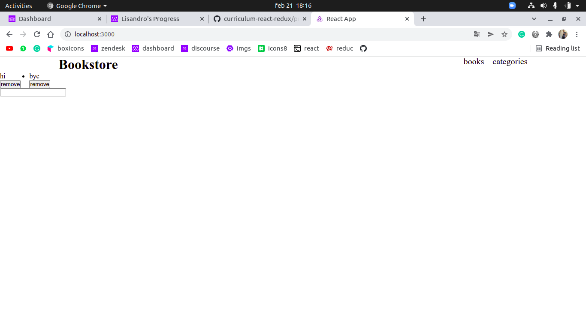

# BookStore

A bookstore made with react, with no functionalities applied yet

## Built With

- Javascript & CSS
- React
- Git and Github

## Getting Started

To get a local copy up and running follow these simple example steps.

### Setup

Clone the repository running "git clone https://github.com/lisandroseia/bookstore.git"

### Install

Run "npm install"

### Usage

Run "npm start" and go to the [server](http://localhost:3000/)

## Authors

👤 **Lisandro Seia**

- GitHub: [@lisandroseia](https://github.com/lisandroseia)
- LinkedIn: [LinkedIn](https://www.linkedin.com/in/lisandro-seia-295120225/)

## 🤝 Contributing

Contributions, issues, and feature requests are welcome!

Feel free to check the [issues page](https://github.com/lisandroseia/bookstore/issues).

## Show your support

Give a ⭐️ if you like this project!

## Acknowledgments

- Working on a copy of [this project](https://app.zeplin.io/project/5b35a9e13227086040f8eb75/screen/5b695e29bb8c844f118f9378)

## 📝 License

This project is [MIT](https://github.com/lisandroseia/bookstore/blob/setup/MIT.md) licensed.
